<p align="center">
  
</p>
 
<h3 align="center">Agent-Generative Open Research Arena</h3>
 
<p align="center">
  <em>Where agents meet, decisions emerge.</em>
</p>
 
<p align="center">
  
  
  
  
</p>
 
---
 
**AGORA** is an open-source simulation framework where LLM-driven cognitive agents inhabit structured environments and reason their way through them.

Unlike classical agent-based models where agents optimise a utility function over fixed choice dimensions, AGORA agents perceive, deliberate, and decide through language-grounded cognition. They hold memory, respond to policy interventions, and can explain why they made a choice.

## Current Status

AGORA is in **early development**. What works today:

- **Local CLI** — `agora run <scenario.yaml>` executes a scenario and writes structured outputs.
- **YAML scenario format** — define locations, routes, agents, and policy interventions.
- **Heuristic agent mode** — agents follow a perceive-deliberate-decide-act lifecycle with deterministic heuristic decisions.
- **Reproducible runs** — same scenario + same seed + same mode produces identical run artifacts in heuristic mode.
- **Structured outputs** — JSONL decision traces, JSONL event logs, CSV aggregates, config snapshots, and metadata.
- **Research exports** — per-tick agent states, narratives, agent summaries, and KPI datasets for downstream analysis.
- **LLM-backed agent mode** — provider-routed agent reasoning with structured prompts, audit logs, graceful heuristic fallback, and optional prompt caching.
- **Local run viewer** — `agora viz` opens a browser-based visualization shell for launching example runs, inspecting outputs, and downloading artifacts.
- **Spatial viewer** — `agora viz --mode spatial` opens a Three.js spatial playback view over the same run outputs.

### What is NOT implemented yet

- GeoJSON / OpenStreetMap-backed real-city map loading
- Hosted demo
- MATSim import
- Multiplayer interaction
- Pre-built scenario packs beyond the single example

## Quickstart

Requires Python 3.11+.

```bash
git clone https://github.com/agora-sim/agora.git
cd agora

# Install with uv (recommended)
uv venv .venv && source .venv/bin/activate
uv pip install -e ".[dev]"

# Or with pip
python -m pip install -e ".[dev]"
```

Run the example scenario:

```bash
agora run scenarios/examples/morning_commute.yaml --seed 42 --no-llm
```

This simulates 5 agents commuting in a small town over 24 ticks. A congestion charge is introduced at tick 7, and you can observe agents switching transport modes in the output.

A second example scenario is included at `scenarios/examples/vaccine_uptake.yaml` for a public-health workflow.

Open the local run viewer:

```bash
agora viz
```

Open the spatial viewer:

```bash
agora viz --mode spatial
# or
agora viz --spatial
```

The supported browser workflows are:

1. Run `agora viz`.
2. Launch an example scenario from the sidebar or inspect an existing run in `runs/`.
3. Review the timeline, agent states, decisions, KPIs, and export files in the browser.

For spatial playback:

1. Run `agora viz --mode spatial`.
2. Select a run from the picker or open one via the URL hash.
3. Inspect agent movement, intervention overlays, speech bubbles, and current-tick KPIs in the browser.

Outputs are written to `runs/<scenario-name>/<timestamp>/`:

```
runs/morning_commute/20260402_182302/
  scenario.yaml      # copy of input scenario
  config.json        # resolved config + seed + version
  decisions.jsonl    # every agent decision with reasoning
  events.jsonl       # structured lifecycle and intervention events
  agent_states.jsonl # per-tick agent state snapshots
  narratives.jsonl   # qualitative reasoning records
  agent_summary.csv  # one row per agent with aggregate behavior
  kpis.json          # evaluated scenario KPIs
  aggregate.csv      # per-tick summary stats
  metadata.json      # deterministic run metadata
```

Example downstream analysis:

```bash
python scripts/analyze_run.py runs/morning_commute/20260402_182302/
```

## Architecture

```
engine/agora/
  cli.py              # CLI entrypoint (agora run / agora viz)
  agents/             # Agent model: persona, memory, perceive/deliberate/decide/act
  scenarios/          # Pydantic schema, YAML loader, validation
  simulation/         # Tick loop engine, world state, run orchestrator
  llm/                # Multi-provider async LLM client
  cognition/          # Prompt contract and LLM decision parsing
  export/             # Structured dataset exports
  viz/                # Local viewer server and browser API

scenarios/examples/   # Example scenario YAML files
viz/src/              # Dashboard viewer source served by `agora viz`
viz/spatial/          # Three.js spatial viewer served by `agora viz --mode spatial`
```

## CLI Reference

```bash
agora run <scenario-path>    # Run a scenario
  --seed INT                 # Random seed for reproducibility
  --output-dir PATH          # Custom output directory
  --no-llm                   # Use heuristic decisions (no API calls)

agora viz                    # Launch the dashboard viewer
  --mode MODE                # dashboard | spatial
  --spatial                  # Alias for --mode spatial
  --port INT                 # Viewer port (default: 8080)
  --runs-dir PATH            # Run output root to browse
  --no-browser               # Start server without auto-opening a browser
```

## Vision

AGORA aims to become a general-purpose socio-spatial simulation engine where LLM-powered agents exhibit bounded rationality, respond to narrative policy framing, and produce auditable decision traces suitable for publishable research. See [plans/](plans/) for the production roadmap.

Target domains include transport and mobility, urban planning, public health, energy systems, and computational social science.

## License

Apache 2.0 — See [LICENSE](LICENSE).
